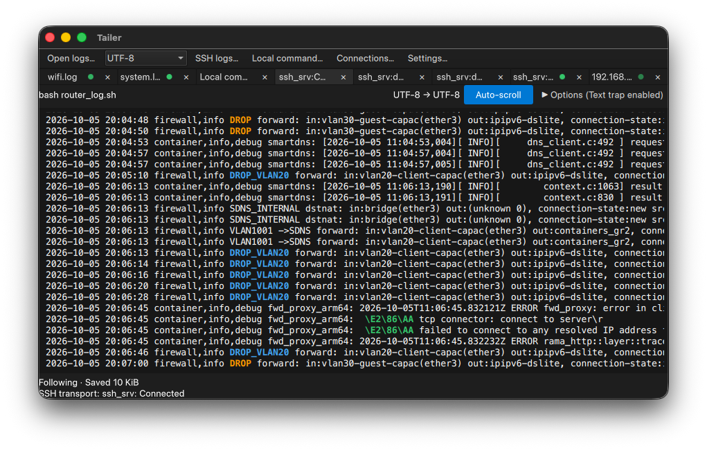

# Tailer
A multi-tab log viewer built with Rust, Qt Bridge for Rust, and Qt Quick.

Tailer follows local files, streams logs over SSH, receives syslog over UDP, and runs custom commands. Received logs are converted to UTF-8 and kept in a bounded rolling buffer: the last 200,000 lines / 25 MiB per tab. Display remains limited to the last 2,000 lines / 256 KiB (matching lines when filtered). Old logs are discarded automatically without stopping collection.

## Requirements

- A recent stable Rust toolchain supporting edition 2024 and the dependencies in `Cargo.lock`. Rust 1.88 alone is not a verified minimum for the current dependency set.
- Qt 6.10 or later with Qt Quick, Controls, and Dialogs, plus a C++ toolchain.
- The Qt Bridge sources at `ext/qtbridge-rust` in the current checkout.
- OS credential-store support through `keyring`. Linux requires a compatible Secret Service provider and a session D-Bus.

The current development environment uses Qt 6.12.0 on macOS arm64. Qt Bridge support for this platform is experimental.

### External command dependencies

| Feature | Local requirement | Remote requirement |
| --- | --- | --- |
| Local file following | None | Not applicable |
| Filtering and history search | None | Not applicable |
| SSH transport and authentication | None; implemented with `russh` | An SSH server |
| Remote file following | None | POSIX-compatible shell and `tail` with `-n` and `-F` |
| Remote Docker logs | None | Docker CLI and daemon access |
| Remote custom commands | None | `/bin/sh` and the commands in the script |
| Local custom commands | `/bin/sh` and the commands in the script | Not applicable |
| Remote privilege escalation | None | `sudo` or `su`, `stty`, and a compatible shell |

Normal file following, searching, and SSH do not require local `tail`, `grep`, or OpenSSH executables. Arbitrary local command execution still depends on the local shell and installed tools.

## Running on the current macOS environment

```sh
export PATH="$HOME/Qt/6.12.0/macos/bin:$PATH"
export DYLD_FRAMEWORK_PATH="$HOME/Qt/6.12.0/macos/lib${DYLD_FRAMEWORK_PATH:+:$DYLD_FRAMEWORK_PATH}"
cargo run --manifest-path $HOME/RustroverProjects/tailer/Cargo.toml
```

These paths describe the development machine; adjust them for your checkout and Qt installation. The first build may require network access to download dependencies.

## Packaging and releases

### macOS application bundle

With your Qt installation's `bin` directory on `PATH`, run:

```sh
just --justfile justfile bundle-macos
open target/release/bundle/macos/Tailer.app
```

Adjust the absolute checkout path for your machine. The packaging script builds
with `cargo build --release --locked`, embeds `icons/icon.icns`, and uses
`macdeployqt` to copy Qt frameworks, plugins, and imported QML modules into the
bundle. Qt does not need to be installed on the destination Mac. The optional
argument to `bundle-macos` is a Rust target triple; in that case the bundle is
under `target/<target>/release/bundle/macos/Tailer.app`. The corresponding Rust
target and compatible Qt libraries must already be installed.

The bundle identifier is `app.tailer.desktop`; change it to an identifier you
control before setting up Developer ID signing. Bundles are ad-hoc signed for
local execution, **not Developer ID signed or notarized**. Downloaded releases
may be blocked by Gatekeeper. Public distribution requires an appropriate
signing/notarization setup; this workflow does not provide one.

### Windows icon

Release builds use the Windows GUI subsystem (no console window). `build.rs`
embeds `icons/icon.ico` into `tailer.exe` using the Windows SDK's `rc.exe`, without
an additional Rust dependency. Build with the MSVC Rust toolchain in a Visual
Studio Developer shell. The workflow sets this environment up and uses
`windeployqt` to include Qt DLLs, plugins, QML modules, and the MSVC runtime.
Windows packages are not Authenticode signed. Windows runtime behavior has not
been verified on the macOS development machine.

## Basic usage

- In **Settings → Appearance**, choose **Auto (system)**, **Light**, or **Dark**. Changes apply immediately and are remembered on restart. Auto follows the OS color scheme, including changes while Tailer is running (where supported by Qt/platform). Appearance and language apply immediately; the collection defaults below them apply to new tabs only.
- Use **Open logs…** or Cmd+O (Ctrl+O on Windows/Linux) to select one or more local files. You can also drag and drop one or more files onto the window to open each in a new tab, using the currently selected local encoding.
- Use **Connections…** to register a name, host, user, port, and private-key path.
- Use **SSH logs…** to select a saved connection and a remote file, Docker container, or custom command.
- Close a tab with its × button or Cmd+W to stop its channel or local collection process.
- Drag a tab left or right and release it over another tab to reorder it. Active sessions and archives are retained, and the selected log stays selected; the tab order is saved. The tab context menu also offers **Close**, **Close other tabs**, and **Close all tabs**. Closing other tabs keeps the right-clicked tab, even if it was inactive. Each close operation asks for confirmation; bulk closing asks only once. Closing stops collection but preserves saved archives and bookmarks.
- Right-click a tab and choose **Register bookmark** to save its current configuration. Use **Bookmarks…** to open or delete saved bookmarks, even after closing the tab or restarting Tailer. Bookmarks preserve the source, SSH connection, encoding, collection limits, filters, searches, auto-scroll, and text traps; passwords are not stored. Opening starts a new collection/archive (custom commands run again), rather than reopening the old archive. Up to 100 bookmarks are supported, and SSH profiles referenced by bookmarks cannot be deleted. Registering an identical configuration again does not create a duplicate; later tab edits do not change existing bookmarks.
- Registration shows only an **OK** confirmation, without opening the bookmark list. **Bookmarks…** displays a scrollable list: double-click a row to create a tab and close the list, or right-click for **Edit…** / **Delete**. Editing lets you freely name the bookmark (a non-empty title is required); the name is saved separately from its original configuration and used as the new tab's title. Existing tabs are unaffected. Older bookmarks initially use their original tab titles. Open, Edit, and Delete buttons are also available.
- Bookmarks are organized in a collapsible group tree. **Create group** adds a top-level group; right-click a group to create a subgroup, rename it, open all its logs, or delete it. Edit a bookmark to select its group. Existing and newly registered bookmarks start in **Unclassified**. Double-clicking a group opens all bookmarks in that group and its descendants, then closes the bookmark window. Groups containing custom commands require confirmation before running them again. Group names, nesting, membership, and expansion state are saved; up to 100 groups are supported. Deleting a group also removes its subgroups but preserves their bookmarks in Unclassified.
- Disabling **Auto-scroll** does not stop reception, archiving, or appending new displayed logs. The viewport does not jump to the bottom. When older displayed lines are removed, stable source-line IDs anchor the line you are reading at the same screen position, including filtered logs and repeated identical text. New lines remain accessible by scrolling down. If the line at the top of your viewport has itself expired from the displayed window, the document temporarily freezes instead of replacing it under your eyes. The next wheel, scroll-key, scrollbar, or drag operation refreshes the latest display window from offset 0. Filter/search/context changes and reconnection also explicitly refresh it; enabling auto-scroll resumes the latest bottom. Resizing alone does not release an expired snapshot.
- Starting a mouse selection pauses auto-scroll. While dragging or text is selected, the main log document stays stable so new output cannot reset the selection or its anchor. Reception, decoding, archiving, and trap alerts continue; clearing the selection applies pending output if the displayed anchor still exists, otherwise the snapshot stays frozen until scrolling or an explicit refresh. Enabling **Auto-scroll** clears the selection and resumes the latest output.
- A green dot indicates newly received logs in an inactive tab. Selecting the tab clears it. Initial data counts as reception, but changing filters or searches does not. Indicators reset on restart.

### Text traps

Use **Enable** beside the filter input to suspend filtering without clearing its expression or numeric options. Right-click a text-trap tag and toggle **Enable** to suspend that tag's detection and highlighting; the same state appears in the trap editor's **Enable** checkbox and is applied on **Save**. Disabled tags are dimmed but remain editable. Enable states and expressions are retained in workspace settings and bookmarks. Older settings default to enabled.

#### Numeric comparisons and background highlights

Both the all-history filter and text-trap editor support an optional **Numeric condition**. Enable **Regex**, enter a pattern such as `.* (\d+)$`, select capture group **1**, operator **>**, and comparison value **100**. For `xxxxxx 200 8 128`, the captured `128` is compared numerically and matches; `100` does not. Supported operators are `>`, `>=`, `<`, `<=`, `==`, and `!=`. Signed numbers, decimals, and scientific notation are supported when the regex captures them (for example `(-?\d+(?:\.\d+)?)$`). Missing/non-numeric captures, NaN, and infinity do not match. Comparisons use finite 64-bit floating-point values, so exact equality is not suitable for arbitrary-precision decimals or very large integers. Filter **Invert** applies after the complete regex/numeric condition. Invalid capture numbers, operators, and comparison values show an error.

In the trap editor, enable **Background highlight** to keep the original text color and add a translucent background. **Opacity (%)** defaults to 25; 0 is fully transparent and 100 fully opaque. **Highlight scope** selects the regex match, captured group (the numeric condition's group, or group 1 without a condition), or all text in the matching line. Line highlighting colors the line's characters, not the empty viewport space after them. Existing traps retain their original text-color highlighting. The filter condition and trap appearance are saved in tab/workspace settings and bookmarks, including after restart.

Numeric traps evaluate each completed line independently and wait for a newline before notifying, so fragmented numbers cannot trigger premature alerts. A final line without a newline can be displayed/filtered/highlighted, but does not trigger a numeric trap notification until its newline arrives. Regex carry is bounded to 256 KiB, as with existing traps; unusually long split lines may exceed that retained context. Filtering never discards archived history, and trap detection remains independent of the display filter.

Enter a literal string or regular expression in **Text trap**, then press **Add** or Enter. Each tab supports up to **10 tags**, with a 1,024-character limit per tag. **Regex** and **Ignore case** are configured per tag. Typing alone does not change active rules.

Click a tag to edit its expression, matching options, and highlight text color (preset swatches, `#RRGGBB`, or a color picker). Press **Save** to apply changes; **×** deletes a tag. Select text in the log view or search results and right-click **Add to Text Trap…** to open the editor with that text. Selected text defaults to literal matching. The search result's line-number arrow opens its surrounding history.

Tags and colors are saved independently for each tab. Existing single-string traps migrate to the first green tag. Removing all tags disables detection.

Traps inspect newly received data independently of the display filter. A match makes the green dot on an inactive tab blink. Selecting the tab clears the alert; matches in the active tab do not blink.

Matching text is highlighted in bold in each tag's chosen color, including previously displayed history, search context, and search results. Earlier tags take color priority where matches overlap. Re-displaying history or changing settings does not trigger another reception alert. Matches can span receive boundaries; configuration changes reset partial-match state. Initial logs are detected only if they arrive after configuration.

Regex uses the same Rust `regex` syntax as filtering/searching; look-around and backreferences are not supported. Zero-length matches are ignored. Streaming regex detection retains up to 256 KiB of previous UTF-8 input (plus boundary bytes), so arbitrarily long cross-receive matches are not guaranteed. A growing match at the same starting position alerts only once; end anchors are evaluated against currently received data, not a finalized file. Sound and OS notifications are not implemented.

## Syslog reception (UDP)

Choose **Syslog…**, enter a numeric IP address and port, and open a receiver tab.
The default `127.0.0.1:1514` accepts only local senders. Use your LAN IP or
`0.0.0.0:1514` to accept IPv4 LAN devices; IPv6 endpoints use `[::1]:1514` or
`[::]:1514`. IPv6 dual-stack behavior depends on the OS. Port 514 may require
additional privileges; 1514 avoids that requirement on typical systems.

BSD/RFC3164, RFC5424, Cisco and Juniper payloads are accepted without header
validation or normalization. Parsing remains in the existing extraction/Roto
analysis pipeline. Each nonempty datagram receives a trailing newline if needed;
embedded newlines remain separate display/analysis lines. Empty datagrams are
ignored. UTF-8 decoding replaces malformed bytes, and datagram boundaries reset
the decoder. Payloads up to the UDP transport limit are received without an
application-side truncation buffer. Existing bounded retention, search, traps,
and analysis apply. Sender IP and reception timestamps are not added to the text.

Closing/stopping a receiver releases its socket. Tab and bookmark settings retain
the endpoint and restart reception when reopened, including at application startup.
Editing/reconnecting a tab starts a new buffer. Bind failures (including an
already-used port) are displayed in the tab status.

The **Syslog labels** checkbox (Syslog tabs only; initially off) replaces valid
leading PRI values with two bracketed, uppercase four-character ASCII labels, e.g.
`<190>` becomes `[INFO][LOC7]`. Severity labels are `EMRG`, `ALRT`, `CRIT`, `ERRO`,
`WARN`, `NOTI`, `INFO`, and `DBUG`. Facility labels include `KERN`, `USER`, `MAIL`,
`DMON`, `AUTH`, `SYSL`, `CRON`, and `LOC0`–`LOC7`; shorter names are space-padded
inside the brackets (e.g. `[DBUG][FTP ]`).
Four color families are used, not eight distinct colors. Removing variable-width
symbols and using equal-length labels aligns valid PRI prefixes in the monospace
log view. Roto helpers still return full names. Selection/copying copies the displayed labels; disable
the checkbox to copy the original PRI. The display filter matches the visible
labels while the option is on (e.g. literal `[DBUG]` or `[DBUG][USER]`), and raw
messages while it is off. Regex, ignore-case, invert, and numeric conditions use
that same matching text. Toggling labels automatically reapplies the filter.
Search, trap matching, archives, and Roto analysis still use the original message.
The option is saved with tabs/bookmarks.
Malformed/missing PRI values are left unchanged.

**UDP has no authentication, encryption, acknowledgements or guaranteed delivery.**
Limit sender access using your firewall; avoid exposing listeners to the public
Internet. Packets may be lost under load, and kernel/network drops are not counted
by this initial implementation. TCP/RFC6587 and TLS/RFC5425 are not implemented.

## Log analysis (Roto prototype)

Choose **Analyze…** in a log tab to configure a pre-extraction line filter and
Regex, delimiter, whitespace, or JSON Lines extraction. Map fields for direct
aggregation, or optionally transform them with a Roto parsing function.
Rust aggregates currently retained logs into grouped counts,
sums, averages, minima, or maxima, independently of the display filter.
Specify result columns such as `path, method, status, avg(elapsed), count()`
for composite grouping and multiple statistics in one pass.
LiteLLM / Uvicorn and Apache CLF + `%D` are protected default presets.
Save named user presets to preserve the full analysis configuration across
tabs and restarts; loading a preset does not automatically execute it.

See [Roto log analysis](docs/roto-analysis.md) for the runtime API, examples,
diagnostics, update behavior, limitations, and tests. Run only trusted scripts;
this prototype is not a hardened sandbox. Unsaved tab edits and active analysis
results are not restored automatically.

## SSH connections

SSH runs inside the application using `russh`. Tabs referencing the same connection ID share one authenticated connection, with an independent channel per tab.

Registering a profile does not connect immediately. The first tab opens the connection, and closing the last referencing tab stops it. Closing one tab does not stop the other channels. If a shared connection is lost, Tailer does not silently create an independent connection. Close and reopen the affected tabs to reconnect; automatic reconnection is not implemented.

Profile edits apply to the next connection. Profiles referenced by tabs cannot be deleted.

### Defaults and OpenSSH compatibility

- A blank user uses the OS user name from `USER` or `USERNAME`.
- Port `0` means `22`.
- A blank key path tries existing `~/.ssh/id_ed25519`, `id_ecdsa`, and `id_rsa`, in that order.
- Explicit key paths may start with `~/`.
- Home-directory lookup uses `HOME`, falling back to `USERPROFILE`.

OpenSSH-format private keys, including encrypted keys, are supported. **`~/.ssh/config`, aliases defined there, ProxyJump, ProxyCommand, ssh-agent, and user/host certificates are not supported.** Profiles migrated from the OpenSSH backend must specify the actual host, user, port, and key as needed.

### Authentication and host keys

Password, private-key passphrase, and keyboard-interactive prompts reach the GUI through in-process messages. No external authentication helper, ASKPASS executable, ControlMaster process, or Unix socket is required.

On first connection, verify the host-key fingerprint through a trusted channel before accepting it. Accepted keys are saved to `~/.ssh/known_hosts`. A changed key of the same algorithm is rejected. Hashed host names are supported. Files containing `@revoked` or `@cert-authority` entries are rejected rather than ignoring unsupported marker semantics.

SSH authentication and host-key confirmation use the shared connection dialog; sudo/su prompts use the tab dialog. Cancelling authentication stops the attempt and reports an error.

Selecting **Save in OS credential store** saves eligible passwords or passphrases through the platform backend. Host-key confirmation and keyboard-interactive answers, including OTPs, are not stored. Stored values are tried once per broker session; another request returns to the dialog. Saved credentials can also be deleted there.

Saving happens when an answer is submitted, not after server verification. A missing or locked credential store may prevent saving; there is no plaintext fallback. Passwords are excluded from workspace JSON, process arguments, and environment variables. Input fields are cleared, but complete erasure of temporary GUI/Rust memory is not guaranteed. Credentials saved by the former backend may need to be entered and saved again.

### Channel replies and diagnostics

PTY and command requests wait for explicit success or failure replies. Window-size notifications before the reply are not treated as failures, and early stdout/stderr is retained. Requests have a 15-second reply timeout and can be cancelled by stopping the tab.

Application-owned diagnostics distinguish rejection, timeout, and connection closure before a reply, and are translated into the selected display language. SSH-library and OS diagnostics remain unchanged. Remote stdout/stderr is archived as logs.

## Remote log sources

### Files

Specify an absolute remote path. Tailer runs `tail -n N -F` on the server. Rotation and truncation follow the remote command's implementation. Lines older than the initial selection are not part of that session's archive or search history.

### Docker containers

Select **Docker container** and enter a name or ID. Tailer runs:

```sh
docker logs --tail N --follow --timestamps CONTAINER
```

No Docker API TCP port needs to be exposed. The SSH user or selected escalation user must have daemon access. Docker permissions are powerful; configure them carefully.

Both stdout and stderr are saved, including Docker CLI diagnostics. Only logs available through the Docker logging setup can be collected. Container enumeration, automatic reconnection, and following recreated containers are not implemented. Live Docker-over-SSH integration has not been verified; tests use a substitute CLI process to check arguments and capture behavior.

### Custom remote commands

Select **Custom command**, enter a script, and optionally provide a tab name. Scripts run through remote `/bin/sh -c`, supporting pipelines, expansions, redirects, and multiple lines.

linux
```sh
kubectl logs -f deployment/web -n production --all-containers=true
podman logs -f --tail 50 web
container logs --follow web
journalctl -f -u nginx --no-pager
tcpdump -i eth0 'not port 22'
```
routeros
```routeros
/log/print follow-only where topics~"firewall"
```


Availability and permissions depend on the server. There is no dedicated resource-selection UI for these tools.

Initial-line options are not automatically added to custom scripts. Specify them in the command. Empty scripts and NUL characters are rejected; the persisted limit is 8,192 characters.

**Commands are saved and rerun when the workspace is restored. Secrets embedded in commands are saved too. Commands can perform arbitrary operations without an additional confirmation dialog.** Use foreground streaming commands. Closing the channel does not guarantee termination of daemonized or detached processes.

Log-source IDs are persisted as `file`, `docker`, or `custom`. Old tabs without an ID restore as file sources.

## Local custom commands

Use **Local command…** to enter a script, tab name, and input encoding. Examples: `docker logs -f --tail 50 web` or `podman logs -f web`.

Scripts run through local `/bin/sh -c` without SSH. Pipelines, multiple lines, stdout/stderr capture, decoding, rolling buffers, searching, and traps are supported. Initial-line options belong in the script.

Commands inherit the application's working directory and environment, including `PATH`. If a GUI launch cannot find a tool, use its absolute path or set `PATH` in the script. Interactive stdin is not supported. Closing the tab stops collection but does not guarantee termination of detached descendants.

Local scripts are persisted and executed again at startup. The security precautions for remote custom commands apply here too.

## Privilege escalation

Select **None**, **sudo**, or **su (login)** and a target user, defaulting to `root`. Passwordless sudo is supported. Password requests appear separately from SSH authentication. Usually sudo requires the SSH user's password and su requires the target user's password, subject to server policy.

Tailer requests a PTY, disables echo and newline conversion, and starts escalation. Passwords are sent over channel stdin. Output before the private readiness marker is excluded from the archive and search. Cancellation or escalation failure stops collection.

The wrappers target Linux/macOS/BSD with compatible sudo/su and POSIX shells. `su - USER -c COMMAND` requires a compatible target-user shell. Custom PAM, multi-stage escalation, localized prompts, csh-style shells, and startup scripts that re-enable echo may not work. sudo uses a specified prompt; su expects English `Password:` with `LC_ALL=C`. After readiness, PTY diagnostics are part of the collected stream. Use only trusted servers.

The PTY/password/marker transport is covered by a Rust test server. Actual production-server sudo/su behavior remains unverified.

## Collection settings and archives

**Settings…** controls initial lines (default: 50). Changes apply to new tabs. SSH tabs can override initial lines when opened; `0` selects newly appended data only. Every tab retains at most the last 200,000 lines / 25 MiB, whichever limit is reached first. Display remains bounded to 2,000 lines / 256 KiB. Legacy capacity settings are retained for workspace compatibility but do not size the buffer. Memory and files grow on demand; the full limits are not allocated at tab creation. Total tab memory also includes original bytes, line indexes, allocation slack, and display data; it is not limited to 25 MiB.

Local following runs in Rust with idle polling every 100 ms. It supports initial last-N-line selection, appends, detected truncation, replacement, and temporary path disappearance. Initial selection recognizes UTF-16LE/BE newline code units. Truncation followed by regrowth between polls may be missed, and unread data in a replaced file may be lost.

Received data is decoded into a bounded memory ring before filtering. Its rolling file path is shown in the UI. Files are appended during normal reception and compacted periodically, not rewritten on every receive. Evicted prefixes can remain temporarily on disk, adding at most approximately 25% to the retained byte limit (UTF-8: 31.25 MiB; original bytes: 125 MiB), excluding transient incoming chunks and re-decoding's temporary file. Filters/searches read only the logical retained memory window, never these stale prefixes. Unix session directories use `0700`, and files use `0600`. These files may contain sensitive data and remain after closing tabs or the app. Remove unwanted session directories manually.

When the buffer fills, the oldest lines are discarded and collection continues. Byte limits prefer removing whole older lines; a single oversized line keeps its UTF-8-safe suffix. Disk-full and write errors still stop collection and appear in status messages. The original source file is never modified.

## Workspace persistence

Tailer saves tab order, profiles, key paths, escalation settings, collection settings, encodings, selected tab, window size, filter/search/trap settings, and auto-scroll. Restoration starts new sessions and reruns saved commands; it does not automatically reopen old archives. Passwords are excluded from JSON.

The format is version 2. Version 1 inline SSH settings migrate into profiles deduplicated by host, user, port, and key. Tabs reference profile IDs.

| OS | Configuration | Session archives |
| --- | --- | --- |
| macOS | `~/Library/Application Support/Tailer/workspace.json` | `~/Library/Caches/Tailer/sessions` |
| Linux | `${XDG_CONFIG_HOME:-~/.config}/Tailer/workspace.json` | `${XDG_CACHE_HOME:-~/.cache}/Tailer/sessions` |
| Windows | `%APPDATA%\Tailer\workspace.json` | `%LOCALAPPDATA%\Tailer\sessions` |

Empty or relative Linux XDG paths fall back to home-directory defaults. Legacy macOS settings from `~/Library/Preferences/tailer.ini` migrate if no new configuration exists. Invalid configuration is reported and not automatically overwritten.

**The application is currently built and tested on macOS.** Platform paths and credential backends do not imply full portability. Linux builds and credential-store integration, and Windows Qt builds, local shells, and access controls remain unverified. SSH no longer depends on Unix sockets.

## Filtering and history search

The **Options** button beside **Auto-scroll** expands the filter, search, match-summary, and text-trap controls. These controls start collapsed for each tab. Collapsing them preserves their values and does not disable filtering, search results, or text-trap detection. The button indicates configured filters, available search results, and configured traps; query errors remain visible even while collapsed. Expansion state is not saved across restarts.

- Filtering scans the full retained 200,000-line / 25 MiB rolling buffer and displays at most the last 2,000 matching lines / 256 KiB. Nonmatching lines stay in this same bounded window so changing the filter does not require reconnecting. A matching line that leaves the normal display can still be found until it is evicted from retention.
- Literal and regex matching use Rust's `regex`, with Unicode case-insensitive matching and inverted filtering. No external `grep` is used.
- Patterns support `\d`, `\s`, and lazy quantifiers such as `.*?`. Lookaround and backreferences are unsupported.
- Regexes are evaluated per line. Syntax differs from the former `grep -E` backend; review saved patterns after migration.
- **Search** scans history independently of the display filter. It counts matches and retains up to the last 2,000 results / 256 KiB.
- Incoming search matches are added incrementally without resetting the result list to the first row. Existing result delegates and text selections are preserved on append; when older matches expire, the currently viewed candidate stays at the same screen position if it remains in the results. If that candidate expires or the result set is replaced, the list returns to its beginning.
- Selecting a result shows ten surrounding lines on each side. **Go live** returns to filtered display.
- The selected history line has a translucent, theme-colored background, while text-trap matches keep their configured text colors. **Go live** or a new search clears the selection and returns to the normal display (respecting any active filter).
- Tabs show a persistent red dot while their log source is disconnected, waiting for a connection, or has stopped collecting. Selecting the tab does not clear it. Once collection is active, the dot is hidden unless there are unread updates (green); text-trap alerts blink green. This indicates the log channel/collector state, not just the shared SSH transport state. Automatic reconnection is not implemented.
- Right-click a tab to **Edit and reconnect…** or **Reconnect / run again**. Editing updates the existing tab, preserving filter/search/trap settings. A new archive is created; previous archives remain on disk. Commands execute again. Shared SSH host/user/key settings are edited separately under **Connections…**.
- Exception: changing only the encoding (and optionally the tab title) reinterprets the current session's original received bytes without reconnecting or rerunning commands. The × button asks for confirmation; Cancel and Escape leave the tab open. When auto-scroll is off, incoming logs preserve the current scroll offset.
- Evicted lines are no longer searchable. Result line numbers remain stable while older lines are evicted; selecting an evicted result cannot recover it.
- Background workers process searches, not the UI thread. Reception updates scan only the bounded buffer.

Example filter for GET requests with selected HTTP status codes:

```regex
"GET [^"]*" (403|404|500)(\s|$)
```

Use this in filter/search fields or a text-trap tag with **Regex** enabled.

## Input encodings and display limits

Choose encoding when opening SSH logs or from the toolbar for new local logs. UTF-8 is the default. Encoding is saved per tab. To correct an existing tab, right-click, choose **Edit and reconnect…**, and change only its encoding; previous and future input use the new decoding without restarting the source. Automatic detection is not implemented.

Supported encodings: UTF-8, CP932, EUC-JP, ISO-2022-JP, UTF-16LE, UTF-16BE, GB18030, BIG5, CP949, WINDOWS-1252, and ISO-8859-1.

`encoding_rs` converts incrementally across receive boundaries. CP932 uses the WHATWG Shift_JIS mapping and CP949 uses EUC-KR. ISO-8859-1 uses exact Latin-1, separately from Windows-1252. No external `iconv` is required. Converted UTF-8 uses a rolling window alongside private original-byte data for re-decoding; authentication responses are excluded. Original bytes also roll over, bounded to 200,000 lines and 100 MiB (four times the UTF-8 byte limit). Re-decoding reads the logical original-byte ring, uses a bounded temporary file, and discards overflow rather than stopping collection. Filters, searches, and traps use UTF-8. Re-decoding is limited to the retained current-session bytes. Starting a replay after eviction can lose multibyte/ISO-2022-JP shift state at its first boundary; the live decoder preserves its state during eviction. OS locale does not control matching.

Malformed input and incomplete characters at stream finalization are replaced and counted in status messages. Encoding selection does not change `LANG`; escalation wrappers use `LC_ALL=C`.

Starting ISO-2022-JP partway through a file may lose shift state. Remote `tail` does not interpret encodings; adjust remote commands for UTF-16 or other affected formats.

UTF-8 retention is limited to 200,000 lines / 25 MiB; display and search results remain limited to 2,000 lines / 256 KiB. There is no unbounded full-history archive. Very long retained lines keep their latest UTF-8-safe suffix after byte-limit eviction. Filter/search line decoding is bounded to 256 KiB per line, and omitted suffixes are not matched. Traps process new input even when it is subsequently evicted. The UI polls background results every 250 ms. Auto-scroll OFF continues displaying appended logs while anchoring the viewport; only expiration of the viewed line freezes the document until the next scroll refresh. Paging is not implemented. Previously created full-history archives are not automatically deleted.

## Display languages

Select Japanese, English, Simplified Chinese, Traditional Chinese, or Korean under **Settings…**. Language can change while running and is persisted. Initial selection follows the Qt-reported locale, falling back to English.

Application labels, dialog buttons, status messages, search summaries, and application-owned errors are translated. Logs, profile/tab names, commands, paths, and external diagnostics are not. Native file-dialog internals follow OS/Qt language settings.

The catalog is `src/translations.txt` in this checkout, with five columns: English key, Japanese, Simplified Chinese, Traditional Chinese, and Korean. Source-code labels and application-owned messages use English keys. `{}` marks dynamic values. Tests check coverage, placeholder counts, and formatted SSH-error translation. Chinese and Korean translations have not had native-speaker review.

## Testing

With the Qt environment configured:

```sh
cargo test --manifest-path Cargo.toml
cargo fmt --manifest-path Cargo.toml --check
```

The last verified code run completed **69 tests successfully**, with one real-OpenSSH test excluded from the default suite. That test also passed separately against a disposable local OpenSSH server.

Coverage includes local following/rotation, decoding, capacity, traps, search, persistence, credentials, host keys, shared SSH channels, key/password/keyboard-interactive authentication, encrypted keys, and PTY transport. Regression tests cover window notifications before channel replies, early output preservation, and English SSH errors.

### Reader tests without Qt

```sh
rustc --edition=2024 --test src/tail.rs -o /tmp/tailer-reader-tests
/tmp/tailer-reader-tests
```

### Real OpenSSH interoperability

Use a disposable server on `127.0.0.1` authorizing the supplied key and user:

```sh
TAILER_TEST_SSH_PORT=2222 \
TAILER_TEST_SSH_USER=testuser \
TAILER_TEST_SSH_KEY=/absolute/path/to/test_private_key \
cargo test --manifest-path Cargo.toml \
  real_openssh_exec -- --ignored
```

The test uses temporary known-hosts storage and a small `printf` script to verify stdout/stderr. The application does not invoke a local SSH client.

### GUI integration checks

With Qt's `bin` directory on `PATH` and its runtime libraries configured, run `python3 scripts/test-log-scroll.py` to check wheel scrolling, auto-scroll suspension, and appended logs using the production log-view component with Qt Quick Test.

Run `python3 scripts/test-rule-enable.py` to check filter enable/disable with retained regex/numeric options and repeated right-click trap toggles using the production controls. The smoke test also checks that the trap editor restores and saves the same enable state; Rust tests cover disabled detection/highlighting and persisted workspace/bookmark states.

Run `python3 scripts/test-trap-results.py` to verify selection, right-click selection preservation, and the context button in the production search-result delegate. The two-tab smoke check also exercises tag addition, expression/color editing, invalid-regex rejection, the 10-tag limit, deletion, cancellation, and tab isolation. Rust tests cover multi-rule streaming matches, overlap priority, HTML safety, bounded UTF-8 carry, and legacy settings migration.

- `--smoke-test /absolute/path/to/log`: opens two tabs and checks reception, alerts, highlighting, filtering, and searching. Start with `smoke-initial` in the log and append `smoke-appended` after startup. It exits after approximately five seconds.
- `--connection-ui-test`: checks profile creation and remote-source selection.
- `--i18n-test en`: checks language switching and persistence; also accepts `ja`, `zh-CN`, `zh-TW`, and `ko`.

Use `QT_QPA_PLATFORM=offscreen` for headless checks and an empty temporary `HOME`, because UI checks use normal workspace persistence. English UI, connection UI, and the two-tab smoke check have passed on macOS.

Production-server escalation, multi-stage authentication, and live Docker-over-SSH remain outside verified coverage.

## Licensing

Tailer's original project code is licensed under the [MIT License](LICENSE),
Copyright (c) 2026 pnk. Dependencies retain their own licenses; MIT does not
relicense Qt, Qt Bridge, or other third-party components.

The packaging script and release workflow include `LICENSE`,
`THIRD_PARTY_NOTICES.md`, and the entire `licenses` directory. On macOS these
are inside `Tailer.app/Contents/Resources`; Linux and Windows archives include
them beside the executable. See [third-party notices](THIRD_PARTY_NOTICES.md)
for Qt and Qt Bridge licensing and source references.

Including license texts alone does not complete LGPL compliance. Before public
distribution, verify the licenses of all deployed Qt/QML modules, complete the
third-party notice inventory (including Rust dependencies and Qt's bundled
components), provide the corresponding library sources through a compliant
distribution method, and document how to rebuild/relink with modified Qt Bridge
and replace/re-sign Qt libraries. The workflow does not yet provide a complete
corresponding-source release archive or a verified license inventory.
