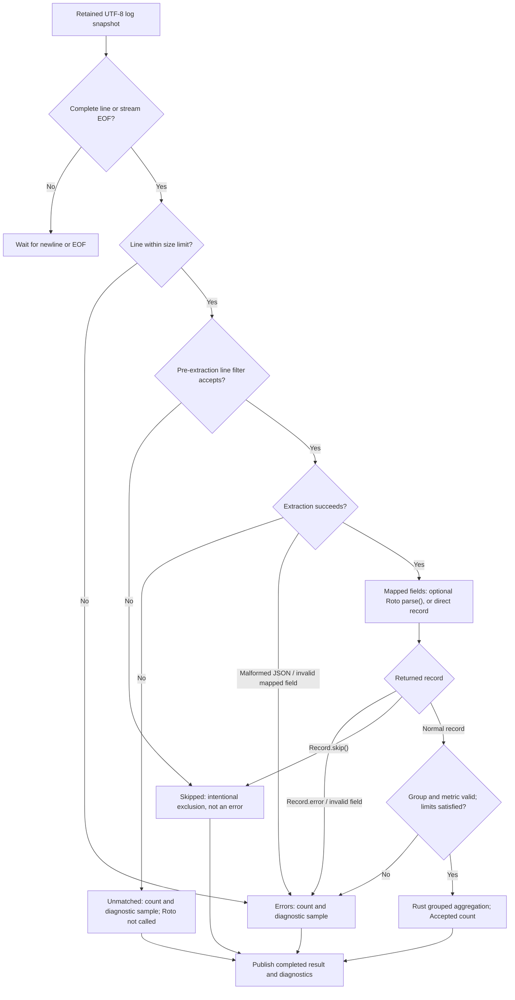

# Roto Log Analysis

Tailer filters and extracts log fields in Rust using settings edited in QML.
An optional Roto script transforms extracted fields into records, which Rust
aggregates. This document describes the currently
implemented prototype, not proposed APIs.

[Back to the README](../README.md#log-analysis-roto-prototype)

## Overview



The UI-configured line filter runs **before extraction**. Rejected lines are
**Skipped** and do not produce extraction diagnostics or invoke Roto. Regex
extraction mismatches are **Unmatched**; malformed JSON and missing/invalid
mapped fields are **Errors**. Roto's `Record.skip()` also intentionally excludes
successfully extracted lines. There is no script-side `accept(line)` callback.

Choose **Analyze…** in a log tab to edit filtering, extraction and optional script.
Drag the title bar to move the analysis dialog, or its bottom-right grip to resize
it. The log remains interactive while the dialog is open. The dialog keeps its
position and size when closed and reopened in the same tab (not across restarts).
Enter result columns, then choose **Apply / recalculate**. Plain fields define
the composite group; aggregate expressions define statistics. For example:

```text
path, method, status, avg(elapsed), max(elapsed), count()
```

## Result-column DSL

The query is parsed to an AST, validated into an execution plan, then fed to a
snapshot-local streaming aggregator in Rust. No SQL engine or external parser
library is involved.

| Expression | Meaning |
| --- | --- |
| `path` | Group by a text or numeric field. Multiple fields form a composite key. |
| `avg(elapsed)` | Arithmetic mean of a finite numeric field. |
| `max(elapsed)` / `min(elapsed)` | Maximum / minimum numeric value. |
| `sum(bytes)` | Sum of a numeric field. |
| `count()` | Number of accepted rows; no argument. |

Output columns follow the exact expression order, including interleaved group
and aggregate columns. At least one aggregate is required; `count()` alone
aggregates all rows into one group. Duplicate group fields and duplicate
aggregate expressions are rejected. Functions are lowercase: `avg`, not `ave`
or `average`. Aliases, arithmetic, nested calls, `count(field)`, `count(*)`,
sorting clauses and general SQL syntax are not supported.

Results are displayed in a table with a fixed header, alternating row colors,
and horizontal/vertical scrolling. Long cell values are elided; hovering a cell
shows its full result value as plain text. Fractional numbers are displayed with
three decimal places, while the tooltip retains the original numeric value.
Live refreshes preserve the scroll position, clamping it when results shrink.
Drag the right edge of a column header to resize that column (minimum 64 pixels).
Header and body widths stay aligned; wide columns are accessible by horizontal
scrolling. Custom widths are remembered by column name within each tab, including
live updates and column reordering, but are not persisted across application restarts.
Click a column header to cycle through ascending, descending, and original
order. An arrow identifies the active sort. Sorting uses full numeric values
or locale-aware string comparison, with equal values retaining source order
and missing values placed last. Text mode uses the same sorted order.
The selected column is remembered by name during live updates and column
reordering; if absent, source order is shown. Sorting is tab-local and not
persisted across application restarts. It does not change aggregation or diagnostics.
Compile errors and diagnostic samples appear separately below the table; the
existing five-sample limit and shortened diagnostic log text remain unchanged.
Enable **Text display** to switch to selectable, copyable tab-separated results
without recalculating. Text mode retains full numeric precision and uses JSON
quoting for strings. Diagnostics remain visible in either mode. The toggle is
local to each tab's dialog and is not persisted across application restarts.
Enable **Merge repeated first-column values** to visually join consecutive equal
values in the first column of the current sorted order. Only the first row of
each run draws its label, internal horizontal borders are hidden, and the run
shares a background color. Other columns, row data, and all cell tooltips remain
unchanged. Comparison uses original typed values, not rounded display text;
missing values are not merged. This is visual grouping, not actual row spanning.
The option defaults to off and is disabled in text mode, which continues to
include every value. It is saved in both named presets and tabs. Selecting a
preset applies its setting; subsequent changes are saved in the tab without
modifying the preset until it is explicitly overwritten. On reopening the app,
the tab's saved setting takes precedence over its preset. Older saved data
without this setting defaults to off.

Unquoted field names use ASCII letters/underscore followed by letters, digits
or underscores. Use backticks for other names: `` `1` ``, `` `response.time` ``
or `` `日本語` ``. Double a backtick inside a quoted name. Queries are limited to
4 KiB and 32 result columns; field names remain limited to 1–64 bytes. Syntax
errors identify a one-based byte position.

All required group and numeric aggregate fields must exist and be valid on
each accepted record. A missing field, wrong numeric type, non-finite value or
overflow rejects the **whole row**: no aggregate, including `count()`, changes.
Numeric sum and counter overflow are checked before committing state updates.
Grouping keys preserve field boundaries and types (`"200"` is distinct from
numeric `200`); numeric `-0` and `0` share a group. Group output is deterministically
sorted by typed composite keys, not by aggregate values. The existing 2,000-group
limit also applies to composite groups.

Every retained snapshot starts with a fresh aggregator: rows stream into it,
then completed results are published. This is not a reception-time incremental
cache, so expired rows do not remain in statistics. Empty input produces no
result rows. Averages/sums use finite `f64`; counts are stored as `u64`, though
very large counts can lose precision when displayed through QML JavaScript.

Result JSON includes `columns` (headers) and `rows[].cells` (ordered typed values).
Legacy `group`, `count`, and `value` properties remain for existing callers;
`value` is the first aggregate result. The old backend grouping/metric/operation
entry point remains supported and is translated into the same execution plan.

## UI-configured input

The line filter supports literal contains, prefix, or Rust regex matching,
case-insensitive matching, and exclusion of matching lines. An empty filter
accepts every line. Regex filters and extraction expressions are compiled once
per settings application on the worker, not on the QML thread.

Extraction formats:

| Format | Field source | Semantics |
| --- | --- | --- |
| Regex | Capture name or numeric string | Same extraction as existing presets. |
| Delimiter | Zero-based column index | Literal separator, including multiple characters; empty columns are preserved. Enter `\t` for a tab. This is not CSV: quoting and escaping are not interpreted. |
| Whitespace | Zero-based column index | Consecutive Unicode whitespace is collapsed, with leading/trailing whitespace ignored; quotes are not interpreted. |
| JSON Lines | JSON Pointer, e.g. `/timing/total` | One JSON value per line, parsed once. Array indices and `~0` / `~1` escapes are supported. No automatic prefix removal. |

Field mappings are currently edited as a JSON array in the dialog, for example:

```json
[
  {"name":"kind","source":"/event","type":"text"},
  {"name":"total","source":"/timing/total","type":"number","required":true}
]
```

Names must be unique and 1–64 bytes; at most 32 mappings are allowed. Types are
`text` or `number`; `required` defaults to true. For JSON, text requires a JSON
string and number requires a JSON number (numeric strings are not coerced).
Missing or null values are absent: required fields fail, optional fields are
omitted. Present values of the wrong type always fail. For other formats,
number fields parse the extracted text as finite `f64`. Numeric values use
floating point and may lose precision for large integers.

Mappings rename sources into a common set of fields. With Roto enabled, these
names are available through `c.text`, `c.has`, and `c.number`. With Roto disabled
(or an empty script), mapped text/numeric fields are aggregated directly.
Empty mappings are allowed only for Regex: they preserve legacy captures for
Roto; direct aggregation outputs captures other than whole-match `0` as text.
Map captures explicitly to obtain numeric fields or include the whole match.

The preview shows the first five complete retained lines, their filter/parse
status and extracted fields **after applying** settings. It runs on the worker
as part of the normal analysis, not synchronously on each editor keystroke.
Preview text and field samples are truncated to 240 bytes and may contain
sensitive data. This first UI uses a JSON mapping editor rather than a row-based
field editor. Unsaved editor settings remain tab-local; named presets are
persistent and shared across tabs.

## Saved analysis presets

The preset selector always includes the protected defaults **LiteLLM / Uvicorn**
and **Apache CLF + %D**, plus the **pg_checkpoint** template.
The PostgreSQL template groups checkpoints into 30-minute local-time buckets,
reports write/sync/total durations in seconds, converts written buffers to KB
(8 KB per buffer), and reports distance and estimate in MB. It also includes the
maximum number of WAL files added. Its regex requires the WAL, distance and
estimate fields in checkpoint-complete lines.
Selecting a preset loads its settings into the current
tab's editor; it does not execute the script or start/restart analysis. Choose
**Apply / recalculate** separately.

Enter a name and choose **Save as new preset** to preserve the complete editor
configuration: line filter and its flags, extraction format and delimiter,
regex, field mappings, Roto enabled state and script (including disabled script
text), and result-column DSL. User presets can be overwritten or renamed with
**Overwrite preset**, and deleted with confirmation. Defaults cannot be
overwritten or deleted; save an edited default under a new name instead.

Names must be unique, nonempty, and at most 256 UTF-8 bytes; up to 100 user
presets are supported. Presets are saved immediately in the existing
`workspace.json` in Tailer's OS-specific configuration directory and restored
after restart. Save errors are displayed in the editor. Only known settings
are persisted; results, previews and log samples are not part of a preset.
The existing settings size limits also apply to presets.

Bounded draft scripts, regexes and queries may be saved even if they do not
compile; executable validation happens when applying, so saving drafts does
not run JIT code on the GUI thread. Field mappings must be a valid typed JSON
array. Scripts and filter literals may contain sensitive text, so do not put
credentials in presets. Run only trusted scripts.

### PostgreSQL checkpoint example (without Roto)

Choose Contains with `checkpoint complete:`, Regex extraction, and:

```text
write=(?P<write>[0-9]+(?:\.[0-9]+)?)\s+s,\s+sync=(?P<sync>[0-9]+(?:\.[0-9]+)?)\s+s,\s+total=(?P<total>[0-9]+(?:\.[0-9]+)?)
```

Map `{"name":"total","source":"total","type":"number"}` in an array,
disable Roto, and enter `avg(total), max(total), count()` as result columns.
Unrelated lines are skipped; checkpoint-complete lines with invalid extraction
produce diagnostics. For JSON Lines, use the mapping example above and choose
JSON Lines instead; the aggregation configuration can remain the same.

## Runtime API

When Roto transformation is enabled and the script is nonempty, it must export:

```text
fn parse(c: Captures) -> Record
```

The expression is compiled once per application of the settings, as is the Roto
script. Named captures retain their names; unnamed groups use numeric string
names such as `"1"`. `c.text("0")` provides the whole match. Use
`^(?P<line>.*)$` to pass a whole line through to the script without
format-specific extraction.

### Syslog helpers

These helpers are available to every Roto analysis script, regardless of input
source. The display's Syslog-label toggle does not affect their input.

| Function | Result |
| --- | --- |
| `syslog_severity_name(code)` | Severity code 0–7 to `Emergency`, `Alert`, `Critical`, `Error`, `Warning`, `Notice`, `Informational`, or `Debug`. |
| `syslog_facility_name(code)` | Facility code 0–23 to its conventional name; 0 is `kernel`, 23 is `local7`. |
| `syslog_severity(line)` | Decode a leading PRI and return its severity name without manual arithmetic. |
| `syslog_facility(line)` | Decode a leading PRI and return its facility name without manual arithmetic. |

Numeric code arguments are `u32`. Invalid codes and missing/malformed PRI return
an empty string. For facilities 0–23, names are `kernel`, `user`, `mail`, `daemon`,
`auth`, `syslog`, `lpr`, `news`, `uucp`, `cron`, `authpriv`, `ftp`, `ntp`, `audit`,
`alert`, `clock`, and `local0`–`local7`. Some implementations use other aliases
for the same facility codes.

Extract the complete line with `^(?P<raw>.*)$`, then use:

```text
fn parse(c: Captures) -> Record {
    Record.new()
        .text("severity", syslog_severity(c.text("raw")))
        .text("facility", syslog_facility(c.text("raw")))
}
```

Result columns `facility, severity, count()` group by these names.

### Captures

| Method | Behavior |
| --- | --- |
| `c.text("name")` | Returns the capture text, or an empty string if missing. |
| `c.has("name")` | Tests whether the capture participated in the match. |
| `c.number("name")` | Parses a number; missing or invalid text yields NaN. |

`Record.number` rejects non-finite numbers with a diagnostic. Numeric values use
64-bit floating-point arithmetic, not arbitrary-precision decimal arithmetic.

### Records and helpers

| API | Behavior |
| --- | --- |
| `Record.new()` | Creates an empty output record. |
| `.text("field", value)` | Adds a string field. |
| `.number("field", value)` | Adds a finite numeric field. |
| `Record.skip()` | Deliberately excludes a line from aggregation. |
| `Record.error("reason")` | Reports a parsing problem for a line. |
| `strip_query(value)` | Removes query strings and fragments without decoding the path. |

Field setters return a record, so calls can be chained. Setting a field replaces
any previous string or number with the same name. Grouping accepts string or
numeric fields; numeric operations accept numeric fields only.

### String methods

Roto 0.12 provides these methods on strings returned by `c.text(...)` as well as
string literals. No additional Tailer host functions are needed.

| Method | Example | Result |
| --- | --- | --- |
| `.contains(text)` | `"/ui/policies/".contains("policies")` | `true` |
| `.starts_with(prefix)` | `"/ui/policies/".starts_with("/ui/")` | `true` |
| `.ends_with(suffix)` | `"/ui/policies/".ends_with("/")` | `true` |
| `.to_lowercase()` | `"INFO".to_lowercase()` | `"info"` |

The three matching methods are case-sensitive. For case-insensitive matching,
normalize explicitly, for example `c.text("level").to_lowercase() == "info"`.
These methods operate on literal strings, not regular expressions.

### Datetimes and time-series grouping

For script-like usage without `match`, use the convenience **`Datetime`** type
(lowercase `t`, distinct from the strict `DateTime` API):

| Convenience API | Behavior |
| --- | --- |
| `Datetime.parse(text, format)` | Always returns a datetime wrapper. Parses timezone-free input using the same rules/limits as `NaiveDateTime.parse`. |
| `Datetime.parse_rfc3339(text)` | Always returns a wrapper; successful timestamps are normalized to UTC. |
| `dt.is_valid()` | Whether parsing and subsequent timezone/floor operations succeeded. Does not validate a later output format. |
| `dt.format(format)` | Returns a string directly; empty on invalid input, invalid output format or size overflow. |
| `dt.to_local()` | Converts a timezone-aware instant to the timezone of the PC running Tailer, not the remote log host. Naive input fails until an offset is attached. |
| `dt.fixed_offset_east(hours)` | Attaches UTC+hours to naive input without changing wall time; converts aware input to UTC+hours without changing the instant. |
| `dt.fixed_offset_west(hours)` | As above, using UTC−hours. Both accept integer hours 0–23; repeated calls do not add hours cumulatively. Fixed offsets do not implement DST. |
| `dt.floor_hours(width)` | Floors wall-clock hours relative to midnight; clears minutes, seconds and fractions. Width must be a positive divisor of 24. |
| `dt.floor_minutes(width)` | Floors wall-clock minutes within the hour; clears seconds and fractions. Width must be a positive divisor of 60 (e.g. 1, 5, 10, 15, 30, 60). |
| `dt.floor_seconds(width)` | Floors wall-clock seconds within the minute; clears fractions. Width must be a positive divisor of 60. |

All timezone and floor methods return a new `Datetime` wrapper, preserving the
original value. Arguments are unsigned integers. Invalid widths/offsets,
out-of-range dates and failed operations produce an invalid wrapper; subsequent
`format()` returns empty. There are no argument-free floor overloads: use
`floor_hours(1)`, `floor_minutes(1)` or `floor_seconds(1)`.

For RFC 3339 timestamps, convert to the desired timezone **before** flooring:

```text
fn parse(c: Captures) -> Record {
    let dt = Datetime.parse_rfc3339(c.text("timestamp"))
        .fixed_offset_east(9)
        .floor_minutes(5);
    let time = dt.format("%Y-%m-%d %H:%M %:z");
    if time == "" { return Record.skip(); }
    Record.new().text("time", time).number("elapsed", c.number("elapsed"))
}
```

With result columns `time, avg(elapsed), count()`, `2026-10-08T01:37:07Z`
enters `2026-10-08 10:35 +09:00`. Use `.to_local()` in place of
`.fixed_offset_east(9)` for the machine's timezone. Naive input needs its source
offset first: `Datetime.parse(text, format).fixed_offset_east(9).to_local()`
interprets the original wall time as UTC+9, then converts that instant.

Local flooring resolves the bucket boundary using the OS timezone. Ambiguous
or nonexistent boundaries during DST transitions are invalid and can be
skipped; it never guesses an occurrence or silently invents a local time.
Include `%:z` in time keys to distinguish repeated wall times. Result keys are
still strings: their lexical ordering across changing offsets is not guaranteed
to be chronological by instant. Named timezone selection and fractional-hour
fixed offsets are not exposed; use OS local time or integer-hour offsets.

For log analysis, deliberately skip unparseable rows without diagnostics:

```text
fn parse(c: Captures) -> Record {
    let dt = Datetime.parse(c.text("timestamp"), "%Y%m%d %H:%M:%S");
    let minute = dt.format("%Y-%m-%d %H:%M");
    if minute == "" {
        return Record.skip();
    }
    Record.new()
        .text("minute", minute)
        .number("elapsed", c.number("elapsed"))
}
```

Use `Datetime.parse_rfc3339(c.text("timestamp"))` instead for Docker/RFC 3339
timestamps. Result columns: `minute, avg(elapsed), count()`. Invalid dates or
formatting failures become **Skipped** with this script, not error samples.
The wrapper itself does not automatically skip rows: if you put its empty
string into a Record without checking, that row can enter an empty-string group.
This intentionally forgiving API does not suppress extraction/mapping errors
that happen before Roto, nor infer statistical outlier thresholds. Explicitly
use `Record.skip()` for any additional exclusions you want.

The strict existing `NaiveDateTime` / `DateTime` APIs remain unchanged:

Datetime parsing/formatting uses Chrono's strftime syntax and returns `None` on
invalid input or unsupported formats, rather than panicking.

| API | Behavior |
| --- | --- |
| `NaiveDateTime.parse(text, format)` | Returns `NaiveDateTime?`. No timezone conversion; formats that parse a timezone offset are rejected rather than silently discarding it. |
| `DateTime.parse_rfc3339(text)` | Returns `DateTime?`. Requires an RFC 3339 timestamp with `Z` or an offset; converts it to UTC. Fractional seconds, including nanoseconds, are supported. |
| `dt.format(format)` | Returns `String?`. For `DateTime`, all output is UTC regardless of the input offset or machine timezone. For `NaiveDateTime`, timezone-dependent directives such as `%z` fail. |

Input timestamps, format strings and formatted output are each limited to
1,024 UTF-8 bytes. Unsupported directives (e.g. `%Q`), incomplete/invalid dates,
and oversized output return `None`. Parsing happens when called for each row;
keep and reuse the parsed value if producing multiple time-derived fields.
`%Y%m%d %H:%M:%S` parses `20261008 01:37:07`; use `%Y-%m-%d %H:%M:%S` for
hyphenated dates and `%.f` for an optional fractional-second component.

For a mapped text field `timestamp` and numeric field `elapsed`, enable Roto:

```text
fn parse(c: Captures) -> Record {
    match NaiveDateTime.parse(c.text("timestamp"), "%Y%m%d %H:%M:%S") {
        Some(dt) => {
            match dt.format("%Y-%m-%d %H:%M") {
                Some(bucket) => Record.new()
                    .text("minute", bucket)
                    .number("elapsed", c.number("elapsed")),
                None => Record.error("Invalid datetime format"),
            }
        },
        None => Record.error("Invalid timestamp"),
    }
}
```

Result columns: `minute, avg(elapsed), max(elapsed), count()`. Include the date
in the key to keep different days separate; `%H:%M` alone intentionally merges
the same time of day across dates. Fixed-width year/month/day/hour/minute keys
sort chronologically for ordinary four-digit years. This groups by existing
minutes; it does not generate missing zero-count minutes or draw graphs.
Use the convenience `Datetime.floor_minutes(width)` API for interval buckets.

For Docker-prefixed PostgreSQL checkpoint logs, use a Contains line filter
`checkpoint complete:`, Regex extraction, and this expression:

```text
^(?P<timestamp>\S+).*?write=(?P<write>[0-9]+(?:\.[0-9]+)?)\s+s,\s+sync=(?P<sync>[0-9]+(?:\.[0-9]+)?)\s+s,\s+total=(?P<total>[0-9]+(?:\.[0-9]+)?)\s+s
```

Field mappings:

```json
[
  {"name":"timestamp","source":"timestamp","type":"text"},
  {"name":"total","source":"total","type":"number"}
]
```

Use this Roto script (the first timestamp is RFC 3339, not naive):

```text
fn parse(c: Captures) -> Record {
    match DateTime.parse_rfc3339(c.text("timestamp")) {
        Some(dt) => {
            match dt.format("%Y-%m-%d %H:%M") {
                Some(bucket) => Record.new()
                    .text("minute", bucket)
                    .number("total_ms", c.number("total") * 1000.0),
                None => Record.error("Invalid datetime format"),
            }
        },
        None => Record.error("Invalid RFC 3339 timestamp"),
    }
}
```

Result columns: `minute, avg(total_ms), max(total_ms), count()`. The supplied
`2026-10-08T01:37:07.185057405Z ... total=9.708 s` example produces UTC minute
`2026-10-08 01:37` and `9708` milliseconds. Save it as a user preset if desired.
For local/fixed-offset conversion and interval flooring, use the convenience
`Datetime` API above; the strict `DateTime` API remains UTC-only.

### Script-side regex compilation

Rust's `regex` engine is also exposed to scripts:

| API | Behavior |
| --- | --- |
| `Regex.compile(pattern)` | Returns `Regex?`: `Some(re)` on success, `None` for invalid patterns, patterns over 16 KiB, or regex-engine compilation limits. |
| `re.is_match(text)` | Tests for a match using the compiled regex; use anchors for whole-string matching. |

Patterns use Rust `regex` syntax; look-around and backreferences are not
supported. **For fixed patterns, put `Regex.compile` in a top-level `const`.**
Roto evaluates the constant initializer once during package compilation when
settings are applied, and keeps its value for the lifetime of the compiled
program. Processing additional lines or reanalyzing snapshots with that program
does not recompile the regex. Reapplying settings creates a new program and
initializes the constant again.

There is no implicit cache: calling `Regex.compile` inside `parse()` instead
compiles once per call, so use that only when runtime-dependent patterns are
necessary. Reusing the returned value for multiple `is_match()` calls does not
recompile it. Method calls share the compiled engine through an `Arc`; there is
no per-line pattern-cache lookup with the constant approach, but host calls and
reference counting still have a cost.

For a minimal experiment, set the extraction expression to `^(?P<line>.*)$`,
enter `count()` as result columns, and use:

```text
const IGNORE: Regex? = Regex.compile("^DEBUG:");

fn parse(c: Captures) -> Record {
    match IGNORE {
        Some(re) => {
            if re.is_match(c.text("line")) {
                Record.skip()
            } else {
                Record.new()
            }
        },
        None => Record.error("Invalid regex"),
    }
}
```

An invalid pattern initializes the constant to `None`; it does not automatically
fail settings application. The example reports a record error for each line in
that case. Regex initialization in constants is included in the settings
compilation time, not recurring snapshot analysis time.

The outer extraction regex still runs first; raw-line entry points and
script-side capture extraction are not implemented.

## Examples and presets

### PostgreSQL checkpoint template

Choose **pg_checkpoint** in the preset selector. The complete template
is also available in [examples/pg-checkpoint.json](examples/pg-checkpoint.json).
It filters `checkpoint complete:` lines, extracts the leading RFC 3339 timestamp,
buffer count, WAL files added, write/sync/total seconds, distance and estimate.
It converts time to the local timezone of the PC running Tailer and groups into
30-minute intervals. Durations remain in seconds; `sum(wrote_kb)` totals written
buffers at 8 KB each, while distance and estimate are divided by 1024 for MB.
Add `count()` to result columns to count checkpoint-complete log rows.

Checkpoints occurring about every five minutes commonly produce one row per
30-minute interval for multiple checkpoints. Change `floor_minutes(30)` to
`floor_minutes(5)` for finer intervals. For example, UTC timestamps `04:17`,
`04:22`, and `04:27` all map to the Japan-time bucket `13:00` with
`count() = 3`; 5-minute flooring separates them into `13:15`, `13:20`, and `13:25`.
Use `fixed_offset_east(9)` instead of `to_local()` for machine-independent Japan
time. The template preserves the supplied date/minute display without an
offset; add `%:z` to the format if repeated DST wall times must stay separate.
Save edits under a new name to retain the protected template.

### LiteLLM / Uvicorn

The **LiteLLM / Uvicorn** preset accepts Docker timestamp-prefixed access logs:

```text
2026-10-07T11:37:54.236480684Z INFO:     123.123.123.123:57260 - "HEAD /ui/policies/ HTTP/1.1" 200 OK
```

Its script removes query strings for URL grouping:

```text
fn parse(c: Captures) -> Record {
    Record.new()
        .text("path", strip_query(c.text("path")))
        .text("status", c.text("status"))
        .text("method", c.text("method"))
}
```

Enter `path, count()` for URL counts, or `status, count()` for HTTP-status counts.

### Filtering matching records in Roto

With the LiteLLM / Uvicorn extraction regex, exclude health checks and internal
URLs before aggregation:

```text
fn parse(c: Captures) -> Record {
    let path = strip_query(c.text("path"));

    if path == "/health" || path.contains("/internal/") {
        Record.skip()
    } else {
        Record.new()
            .text("path", path)
            .text("status", c.text("status"))
    }
}
```

`/health?check=1` is excluded after query removal, as is
`/api/internal/status`. Excluded records increment **Skipped** (「除外」), not
**Errors**, and do not contribute to grouped statistics. Other matching records
retain `path` and `status`, so either field can be selected for grouping.

For prefix-only exclusion, replace `path.contains("/internal/")` with
`path.starts_with("/internal/")`. A line that fails the extraction regex still
increments **Unmatched**: this script only runs after successful extraction.

### Apache CLF + %D

The **Apache CLF + %D** preset accepts Common Log Format, optionally followed by
`%D` in microseconds:

```text
127.0.0.1 - - [07/Oct/2026:11:37:54 +0000] "GET /x?a=1 HTTP/1.1" 200 42 150000
```

```text
fn parse(c: Captures) -> Record {
    let r = Record.new()
        .text("path", strip_query(c.text("path")))
        .text("status", c.text("status"));
    if c.has("duration_us") {
        r.number("duration_ms", c.number("duration_us") / 1000.0)
    } else {
        r
    }
}
```

Enter `path, avg(duration_ms), count()` for mean response times by URL.
Rows without `%D` can be counted, but numeric aggregation reports their missing
metric. This preset is not a general parser for all Apache custom or Combined
Log Formats; adjust the expression for the actual `LogFormat`.

## History and update behavior

Analysis uses all currently retained UTF-8 logs, independently of display
filtering and the 2,000-line display limit. It runs on a separate worker using a
briefly locked copy of the buffer, and publishes only completed results. Changed
logs are reanalyzed two seconds after the previous computation completes.

This prototype intentionally recomputes snapshots rather than maintaining an
incremental record cache: expired rows disappear from statistics, and changing
the grouping or script reanalyzes the available history instead of restarting
a reception-time cumulative counter. The result is **not a lifetime total**.
Unfinished lines wait for newline/stream EOF.

**Stop analysis** keeps the last result. Closing the dialog does not stop
updating. Unsaved scripts and analysis settings are tab-local and are not
restored across tab closure or restart. Explicitly saved presets are persistent,
but active analyses and their results are not automatically resumed.

## Diagnostics and limits

Diagnostics show accepted, intentionally skipped, regex-unmatched, and invalid
record counts, source-line range, analysis time, JIT compilation time, and up to
five failure samples. Compile errors include source locations. JIT compilation
time is the cost of applying settings, not a recurring cost on each update.

### Note: exclusion counts versus custom outlier aggregation

Rows do not need to reach Roto to be counted in diagnostics:

| Where a row is excluded or fails | Reaches Roto? | Diagnostic count |
| --- | --- | --- |
| Pre-extraction line filter rejects it | No | Skipped |
| Extraction regex does not match | No | Unmatched |
| JSON parsing or mapped-field validation fails | No | Errors |
| Datetime parsing in Roto fails and the script returns `Record.skip()` | Yes | Skipped |

`Record.skip()` excludes the row from result-column aggregation and does not
produce a failure sample, but still increments Skipped. That counter combines
pre-filter exclusions and script exclusions; it does not classify their reasons.
To count script-detected invalid values by category instead, return a normal
record, for example:

```text
fn parse(c: Captures) -> Record {
    let dt = Datetime.parse(c.text("timestamp"), "%Y%m%d %H:%M:%S");
    if !dt.is_valid() {
        return Record.new().text("category", "invalid_timestamp");
    }
    Record.new().text("category", "valid_timestamp")
}
```

Use `category, count()` as result columns. Such classified rows are Accepted,
not Skipped. Missing numeric fields still reject a whole row when numeric
aggregates are requested; do not substitute zero for invalid values just to
include them, as that distorts statistics. Run classification counts separately
from normal numeric statistics when needed. Failures before Roto cannot be
custom-classified by the script in the current pipeline; only their built-in
diagnostic counts are available. Statistical outliers require explicit script
conditions and are not automatically inferred from parse failures.

| Limit | Value |
| --- | --- |
| Distinct groups | 2,000 |
| Output fields per record | 32 |
| Field-name length | 1–64 bytes |
| Text value | 1,024 bytes |
| Analyzed line | 256 KiB |
| Script | 64 KiB |
| Extraction expression | 16 KiB |
| Failure samples | 5 |

Overflowing groups and invalid records are reported rather than silently merged.
Samples may contain sensitive log data; they remain in the analysis UI and are
not uploaded or written to a separate diagnostics file.

## Safety and current gaps

Tailer depends on the Roto `0.12` release series; `Cargo.lock` currently resolves
version `0.12.0`. No networking, filesystem, or command-execution host functions
are exposed.

Cancellation is cooperative between lines; this is **not a hardened sandbox**
and there is no forced timeout for an individual JIT call. Run only trusted
scripts.

Time-series graphs, automatic tab-analysis restoration, and extraction-result
caching are not implemented in this prototype.

## Tests

From the checkout root, with Qt runtime libraries configured:

```sh
cargo test analysis::tests
python3 scripts/test-analysis.py
```

Build before running the GUI integration check. It checks the production editor,
tab isolation, regrouping, compile errors, recovery, and live updates in an
isolated temporary workspace.

The optional throughput measurement has no timing assertion:

```sh
cargo test benchmark_retained_access_logs -- --ignored --nocapture
```